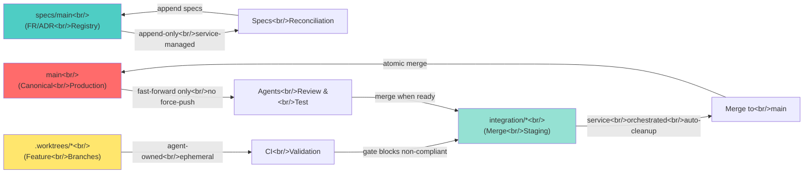
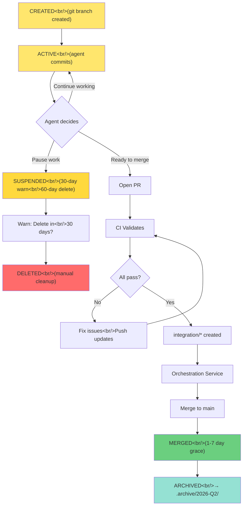

# SSOT Architecture — Visual Guide

**Format**: Mermaid diagrams + ASCII flowcharts
**Purpose**: Quick understanding of key concepts
**Updated**: 2026-03-30

---

## 1. Three-Branch Model



---

## 2. Spec Conflict Resolution Flow

```
Two Agents, Both Add New FRs
================================

Agent 1: FUNCTIONAL_REQUIREMENTS.md          Agent 2: FUNCTIONAL_REQUIREMENTS.md
  + FR-001-022: Feature A                       + FR-001-023: Feature B
  + FR-001-023: Feature A Part 2                + FR-001-024: Feature C

                    ↓                                        ↓
                Both Open PRs to main

                    ↓ ↓
            Reconciliation Service:

    CONFLICT DETECTED: Both defined FR-001-023

    ┌────────────────────────────────────────┐
    │ Resolve Collision Algorithm:            │
    │                                         │
    │ 1. Find all FRs in Agent 1 branch      │
    │ 2. Find all FRs in Agent 2 branch      │
    │ 3. Check for ID overlap → FR-001-023   │
    │ 4. Reassign Agent 2's ID:              │
    │    FR-001-023 → FR-001-025             │
    │ 5. Update Agent 2's branch             │
    │ 6. Merge both to SPECS_REGISTRY.md     │
    │ 7. Log resolution to AUDIT_LOG.md      │
    └────────────────────────────────────────┘
                    ↓

         BOTH PRs MERGE WITHOUT CONFLICT ✅

    SPECS_REGISTRY.md (after merge):
      - FR-001-022: Feature A (by Agent 1)
      - FR-001-023: Feature A Part 2 (by Agent 1)
      - FR-001-024: Feature B (by Agent 2, was 023)
      - FR-001-025: Feature C (by Agent 2, was 024)
```

---

## 3. Multi-Agent Merge Orchestration

```
5 Agents Want to Merge Simultaneously
=====================================

Agent 1 Integration Branch Ready     Agent 2 Integration Branch Ready
             ↓                                     ↓
      integration/feat-1                   integration/feat-2
             ↓                                     ↓
Agent 3 Ready                      Agent 4 Ready          Agent 5 Ready
      ↓                                  ↓                    ↓
integration/feat-3           integration/feat-4        integration/feat-5

    ALL QUEUE UP (No Blocking!)

         ↓ ↓ ↓ ↓ ↓

    Reconciliation Service:

    ┌─────────────────────────────────────────┐
    │ 1. Collect all 5 integration/* branches │
    │ 2. Check for conflicts:                 │
    │    - feat-1 + feat-2: No overlap ✓      │
    │    - feat-1 + feat-3: Shares Dep X ✗    │
    │    - feat-4 + feat-5: No overlap ✓      │
    │                                         │
    │ 3. Topological sort:                    │
    │    - feat-1 must merge first (no deps)  │
    │    - feat-3 must merge after feat-1     │
    │    - feat-2, feat-4, feat-5 can merge   │
    │      in parallel (no deps)              │
    │                                         │
    │ 4. Merge order:                         │
    │    [feat-1] [feat-2, feat-4, feat-5]    │
    │              (parallel)                 │
    │    [feat-3] (after feat-1 done)         │
    │                                         │
    │ 5. Total time:                          │
    │    5 serial merges = 25 min             │
    │    With parallelization = 10 min        │
    └─────────────────────────────────────────┘

    Result: All agents merged, no bottleneck ✅
```

---

## 4. Worktree Lifecycle State Machine



---

## 5. FR↔Test Traceability

```
Perfect 1:1 Mapping
===================

FUNCTIONAL_REQUIREMENTS.md:
  ┌─────────────────────────────────┐
  │ FR-001-022: Event Sourcing      │
  │ Status: IMPLEMENTED             │
  │ Tests: ✓ event_store_test.rs    │
  └─────────────────────────────────┘
         ↑           ↑
    Added by    References by
    Agent 1     Tests (see below)

crates/phenotype-event-sourcing/tests/event_store_test.rs:
  ┌────────────────────────────────────────┐
  │ #[test]                                │
  │ fn test_append_only_store() {          │
  │     // Traces to: FR-001-022           │
  │     ...                                │
  │ }                                      │
  └────────────────────────────────────────┘
         ↑
    Test References FR

    Every FR has >=1 test
    Every Test has >=1 FR
    100% Coverage ✅

CI GATE:
  If coverage < 100%:
    ✗ Build FAILS
    Error: "Test_X references missing FR"

  If coverage = 100%:
    ✓ Build PASSES
    Check: "FR↔Test coverage: 100%"
```

---

## 6. Dependency Graph Validation

```
Before Merge: Dependency Check
==============================

Agent wants to merge code that adds:
  crate phenotype-contract depends on phenotype-iter
  crate phenotype-iter depends on phenotype-contract

    ↓

Circular Dependency Detected!

    ↓

┌──────────────────────────────────┐
│ Pre-commit hook blocks commit    │
│ OR CI gate blocks merge          │
│                                  │
│ Error message:                   │
│ "Circular dep: A → B → A"        │
│                                  │
│ Suggestion:                      │
│ "Extract common module X to      │
│  break the cycle"                │
└──────────────────────────────────┘

    ↓

Agent fixes by:
  1. Creating new crate: phenotype-shared-types
  2. Moving common code there
  3. Both phenotype-contract and phenotype-iter
     depend on phenotype-shared-types (no cycle)

    ↓

Revalidate: No cycle detected ✓

    ↓

Merge allowed ✓
```

---

## 7. Concurrent Spec Merge Service

```mermaid
sequenceDiagram
    participant Agent1 as Agent 1&lt;br/&gt;Feature Branch
    participant Agent2 as Agent 2&lt;br/&gt;Feature Branch
    participant GitHub as GitHub&lt;br/&gt;PR Checks
    participant Service as Reconciliation&lt;br/&gt;Service
    participant Registry as SPECS_REGISTRY.md
    participant Audit as AUDIT_LOG.md

    Agent1 ->> GitHub: Push FUNCTIONAL_REQUIREMENTS.md&lt;br/&gt;(+ FR-001-022, FR-001-023)
    Agent2 ->> GitHub: Push FUNCTIONAL_REQUIREMENTS.md&lt;br/&gt;(+ FR-001-023, FR-001-024)

    GitHub ->> Service: Webhook: Both branches&lt;br/&gt;modified FUNCTIONAL_REQUIREMENTS.md

    Service ->> Service: Parse both branches
    Service ->> Service: Detect collision: FR-001-023

    Service ->> Service: Reassign Agent2's IDs&lt;br/&gt;FR-001-023 → FR-001-025&lt;br/&gt;FR-001-024 → FR-001-026

    Service ->> Agent2: Update branch&lt;br/&gt;(auto-commit with new IDs)

    Service ->> Registry: Append Agent1 specs&lt;br/&gt;(FR-001-022, FR-001-023)
    Service ->> Registry: Append Agent2 specs&lt;br/&gt;(FR-001-025, FR-001-026)

    Service ->> Audit: Log collision resolution&lt;br/&gt;Timestamp, agents, reassignments

    Service ->> GitHub: All specs merged ✓&lt;br/&gt;Both PRs ready

    Agent1 ->> GitHub: Merge to main ✓
    Agent2 ->> GitHub: Merge to main ✓
```

---

## 8. Phase Timeline Overview

```
        Phase 1                    Phase 2                 Phase 3
    Specs Canon.              Dep. Reconciliation      Platform Chassis
    (2 weeks)                 (4 weeks)                (4 weeks)

    ├─────────┤               ├──────────┤             ├──────────┤

    Mon Tue Wed Thu Fri       Mon Tue... Thu Fri       Mon Tue... Thu Fri
     1   2   3   4   5         1   2  ... 24  25        1   2  ... 28  29

    ✓ Resolve   ✓ Deploy           ✓ Parallel    ✓ Symlink  ✓ Intent-driven
      conflicts   spec service        merges        governance  module loading

    ✓ Create    ✓ FR↔Test          ✓ Circular    ✓ Platform ✓ Health
      specs/main   gate              deps           contracts  monitoring

    ✓ Index     ✓ Agent training   ✓ Topology    ✓ Breaking
      specs                           sort          change
                                                    detection


  Parallel Effort:
    Phase 1: 8-10 agents x 2 weeks = ~16-20 agent-weeks
    Phase 2: 12-15 agents x 4 weeks = ~48-60 agent-weeks
    Phase 3: 15-20 agents x 4 weeks = ~60-80 agent-weeks
    ────────────────────────────────────────────────────
    Total: ~125-160 agent-weeks (achievable with 50+ agents in parallel)
    Wall-clock: ~10-12 weeks
```

---

## 9. System Health Scorecard

```
Current (Pre-SSOT)          Phase 1 Complete         Phase 2 Complete        Phase 3 Complete
────────────────            ────────────────         ────────────────        ────────────────

Spec Management:            Spec Management:         Spec Management:        Spec Management:
  No versioning: 🔴           Versioned: ✅             Versioned: ✅            Versioned: ✅
  Manual conflicts: 🟠        Auto-resolve: ✅         Auto-resolve: ✅         Auto-resolve: ✅
  Score: 30/100              Score: 75/100            Score: 85/100           Score: 95/100

Dependency Mgmt:            Dependency Mgmt:         Dependency Mgmt:        Dependency Mgmt:
  Manual graph: 🟠            Canonical graph: 🟡      Automated validation: ✅ Automated validation: ✅
  Build-time checks: 🟠       Build-time checks: 🟠   Pre-commit checks: ✅    Pre-commit checks: ✅
  Score: 35/100              Score: 40/100            Score: 80/100           Score: 90/100

Merge Orchestration:        Merge Orchestration:     Merge Orchestration:    Merge Orchestration:
  Serial queue: 🔴           Serial queue: 🔴         Parallel staging: ✅    Parallel staging: ✅
  Manual handling: 🟠        Manual handling: 🟠      Orchestration svc: ✅   Orchestration svc: ✅
  Score: 25/100              Score: 25/100            Score: 85/100           Score: 95/100

Governance:                 Governance:              Governance:             Governance:
  Scattered files: 🔴       Scattered files: 🔴      Scattered files: 🔴     Centralized: ✅
  Git conflicts: 🔴          Git conflicts: ✅        Git conflicts: ✅        Git conflicts: ✅
  Score: 20/100              Score: 35/100            Score: 40/100           Score: 95/100

────────────────────────────────────────────────────────────────────────────────────────────
OVERALL HEALTH:             OVERALL HEALTH:          OVERALL HEALTH:         OVERALL HEALTH:
    42/100 🔴                  44/100 🟠                 82/100 🟡               94/100 ✅
  (Critical)                  (Warning)                (Good)                (Production-Ready)
```

---

## 10. Common Agent Workflows

### Workflow A: Feature Development + Spec

```
1. CREATE FEATURE BRANCH
   git checkout -b .worktrees/agileplus/feat/my-feature main

2. ADD SPEC (optional, if new behavior)
   cat >> FUNCTIONAL_REQUIREMENTS.md
   ## FR-001-NNN: My Feature
   - Status: PROPOSED
   - Traces To: &lt;spec-id&gt;
   - Tests: path/to/test

3. IMPLEMENT + TEST
   [write code]
   cargo test
   git commit -am "feat: implement FR-001-NNN"

4. OPEN PR
   gh pr create --head .worktrees/agileplus/feat/my-feature --base main

5. SERVICE HANDLES REST
   ✓ Detects FR-ID collision (if any)
   ✓ Auto-reassigns IDs
   ✓ Merges specs to registry
   ✓ Validates FR↔Test mapping
   ✓ Blocks if circular deps

6. MERGE
   [Once all checks pass]
   gh pr merge (automatic merge to main via orchestration)

7. CLEANUP
   [After 7 days]
   Service auto-archives .worktrees/agileplus/feat/my-feature
```

### Workflow B: Bug Fix (No Spec Needed)

```
1. CREATE FEATURE BRANCH
   git checkout -b .worktrees/phenotype-infrakit/fix/bug-name main

2. FIX BUG
   [write tests for fix]
   [implement fix]
   cargo test

3. CHECK TEST TRACEABILITY
   Do my new tests reference existing FR?
   If no → Add reference: // Traces to: FR-001-015
   If yes → Great, continue

4. COMMIT + PUSH
   git commit -am "fix: resolve bug-name"
   git push origin .worktrees/phenotype-infrakit/fix/bug-name

5. OPEN PR + MERGE
   (Same as above)
```

---

## 11. Glossary (Visual)

| Term | Meaning | Example |
|------|---------|---------|
| **main** | Production source of truth | `git checkout main` |
| **specs/main** | FR/ADR registry (read-only) | Service appends specs |
| **.worktrees/** | Your feature branch home | `.worktrees/agileplus/feat/my-feature` |
| **integration/** | Merge staging (service-managed) | `integration/my-feature` (auto-created) |
| **FR-001-NNN** | Functional requirement ID | FR-001-022 (project 001, sequence 022) |
| **SPECS_REGISTRY.md** | Canonical spec index | All FRs versioned + indexed |
| **AUDIT_LOG.md** | Decision trail | "Collision resolved: FR-001-023 → FR-001-025" |
| **Reconciliation Service** | Auto-conflict resolver | Runs on every PR (Phase 1) |
| **Orchestration Service** | Auto-merge orchestrator | Runs after specs merge (Phase 2) |

---

## Summary: Why This Matters

```
WITHOUT SSOT Architecture (Current):
  - Merge conflicts: 2-3x/week (5 min each)
  - Spec divergence: Happens silently
  - Merge queue: Serial (1 at a time)
  - Governance: Scattered (5 copies)

  Result: 50+ agents block each other 🔴

WITH SSOT Architecture (Proposed):
  - Merge conflicts: Auto-resolved (0 manual)
  - Spec divergence: Impossible (append-only registry)
  - Merge queue: Parallel (topological order)
  - Governance: Centralized (1 source)

  Result: 50+ agents work in parallel ✅
```

---

**Next Step**: Read full architecture in `POLYREPO_SSOT_ARCHITECTURE.md`
